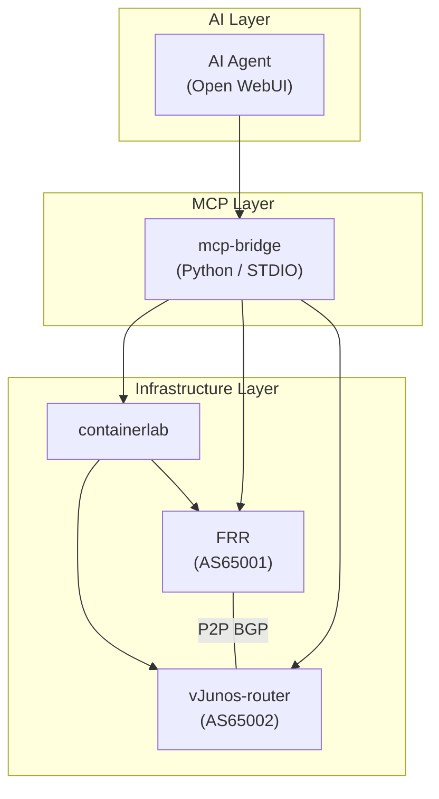

# 🌐 Clab AI Orchestrator

AIエージェントによるネットワーク検証自動化プラットフォーム。  
[containerlab](https://containerlab.dev/) + FRRouting + vJunos-router を使用したハイブリッドネットワークラボを、MCP（Model Context Protocol）サーバ経由でAIから操作します。

## 🏗 アーキテクチャ



## ⚡ クイックスタート

### 前提条件

- Ubuntu 24.04
- sudo 権限
- vJunos-router QCOW2 イメージ（[Juniper](https://www.juniper.net/) からダウンロード）

### 1. セットアップ

```bash
# リポジトリをクローン
git clone https://github.com/<your-org>/clab-ai-orchestrator.git
cd clab-ai-orchestrator

# vJunos イメージを配置
cp /path/to/vJunos-router-25.4R1.12.qcow2 images/

# セットアップスクリプトを実行
sudo bash setup/install.sh
```

### 2. ラボをデプロイ

```bash
sudo clab deploy -t labs/basic-bgp/topology.clab.yml
```

### 3. 疎通確認

```bash
# FRR の BGP 状態
docker exec clab-basic-bgp-frr1 vtysh -c "show ip bgp summary"

# vJunos の BGP 状態
docker exec clab-basic-bgp-vjunos1 cli show bgp summary
```

### 4. MCP Bridge を起動

```bash
cd mcp-bridge
pip install -e .
mcp-bridge  # STDIO mode
```

## 📂 プロジェクト構造

```
├── agent.md              # AI エージェント定義
├── setup/                # セットアップスクリプト
├── labs/                 # containerlab トポロジ定義
│   └── basic-bgp/        # FRR + vJunos P2P BGP ラボ
├── mcp-bridge/           # MCP サーバ (Python)
│   └── src/mcp_bridge/
│       ├── server.py      # メインサーバ
│       └── tools/         # clab / frr / junos ツール
├── vendors/              # ベンダー別パーサ・テンプレート
│   ├── frr/
│   └── junos/
├── images/               # VM イメージ (git管理外)
└── docs/                 # ドキュメント
```

## 🔧 MCP ツール一覧

| ツール | 説明 |
|--------|------|
| `clab_deploy` | containerlab トポロジをデプロイ |
| `clab_destroy` | トポロジを破棄 |
| `clab_inspect` | ノード状態を確認 |
| `frr_show` | FRR で show コマンドを実行 |
| `frr_config` | FRR に設定を投入 |
| `junos_show` | vJunos で show コマンドを実行 |
| `junos_config` | vJunos に設定を投入 |

## 📚 ドキュメント

- [セットアップガイド](docs/setup-guide.md) - 詳細インストール手順
- [アーキテクチャ](docs/architecture.md) - 設計思想と構成
- [トラブルシューティング](docs/troubleshooting.md) - よくある問題と対処法

## 📄 ライセンス

MIT License
