# 🌐 Clab AI Orchestrator

An AI-powered network lab automation platform.  
Operate any [containerlab](https://containerlab.dev/) topology through MCP (Model Context Protocol) — deploy, verify, troubleshoot, and document, all driven by AI.

## 🏗 Architecture

```mermaid
graph TB
    subgraph "AI Layer"
        AI["AI Agent<br/>(Open WebUI / LLM Client)"]
    end

    subgraph "MCP Layer"
        MCP["mcp-bridge<br/>(Python / STDIO)"]
        TOOLS["Vendor Tools<br/>FRR · Junos · ..."]
        MCP --> TOOLS
    end

    subgraph "Infrastructure Layer"
        CLAB["containerlab"]
        TOPO["Any Topology<br/>(multi-vendor, multi-protocol)"]
        CLAB --> TOPO
    end

    AI --> MCP
    TOOLS --> CLAB
```



## ⚡ Quick Start

### Prerequisites

- Ubuntu 24.04
- sudo privileges
- NOS images (e.g., vJunos-router QCOW2 from [Juniper](https://www.juniper.net/))

### 1. Setup

```bash
git clone https://github.com/<your-org>/clab-ai-orchestrator.git
cd clab-ai-orchestrator

# Place NOS images
cp /path/to/vJunos-router-25.4R1.12.qcow2 images/

# Run setup script
sudo bash setup/install.sh
```

### 2. Deploy a Lab

```bash
sudo clab deploy -t labs/basic-bgp/topology.clab.yml
```

### 3. Verify

```bash
# FRR BGP status
docker exec clab-basic-bgp-frr1 vtysh -c "show ip bgp summary"

# vJunos BGP status
docker exec clab-basic-bgp-vjunos1 cli show bgp summary
```

### 4. Start MCP Bridge

```bash
cd mcp-bridge
pip install -e .
mcp-bridge  # STDIO mode
```

Or run in Docker:

```bash
docker compose up -d
```

## 📂 Project Structure

```
├── agent.md              # AI agent definition
├── setup/                # Setup scripts
├── labs/                 # Containerlab topology definitions
│   └── basic-bgp/        # FRR + vJunos P2P BGP lab
├── mcp-bridge/           # MCP server (Python)
│   └── src/mcp_bridge/
│       ├── server.py      # Main server
│       └── tools/         # clab / frr / junos tools
├── vendors/              # Vendor-specific parsers & templates
│   ├── frr/
│   └── junos/
├── samples/              # Usage examples & scenarios
├── images/               # VM images (git-ignored)
└── docs/                 # Documentation
```

## 🔧 MCP Tools

| Tool | Description |
|------|-------------|
| `clab_deploy` | Deploy a containerlab topology |
| `clab_destroy` | Destroy a topology |
| `clab_inspect` | Inspect node status |
| `frr_show` | Execute show commands on FRR nodes |
| `frr_config` | Push configuration to FRR nodes |
| `junos_show` | Execute show commands on vJunos nodes |
| `junos_config` | Push configuration to vJunos nodes |

## 📚 Documentation

- [Setup Guide](docs/setup-guide.md) — Detailed installation steps
- [Architecture](docs/architecture.md) — Design and component overview
- [Repository Structure](docs/repository-structure.md) — Directory layout explained
- [Roadmap](docs/roadmap.md) — Project roadmap
- [Version Strategy](docs/version-strategy.md) — Dependency pinning policy
- [Troubleshooting](docs/troubleshooting.md) — Common issues and fixes

## 📄 License

MIT License
