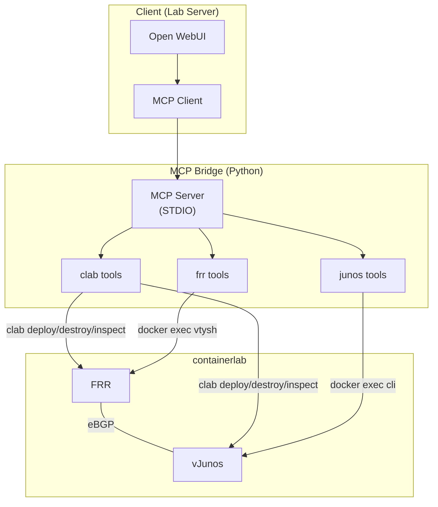

# Architecture

## Overview

## Components

### mcp-bridge
- **Role**: Mediates between AI agents and network devices
- **Transport**: STDIO (HTTP+SSE can be added later)
- **Language**: Python (mcp SDK)
- **Tools**: containerlab operations, FRR operations, Junos operations

### vendors/
- **Role**: Vendor-specific output parsers and configuration templates
- **FRR**: Regex-based parsers for vtysh output
- **Junos**: Parsers supporting both text and JSON (`| display json`)
- **Templates**: Jinja2-format configuration templates

### labs/
- **Role**: Containerlab topology definitions and initial configs
- **basic-bgp**: Minimal eBGP topology with FRR + vJunos

## Design Principles

1. **State-First**: Always verify state before and after changes
2. **Docs-as-Code**: Keep code and documentation in sync
3. **Vendor Abstraction**: Isolate vendor-specific logic in `vendors/` for easy NOS additions
4. **Safety**: Only `show` commands via `*_show` tools; config changes require explicit `*_config` tools
