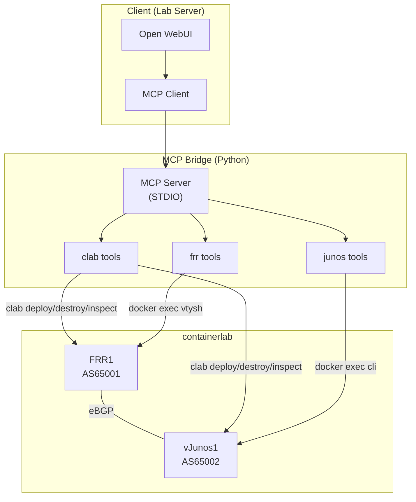

# アーキテクチャ

## 全体構成

## コンポーネント

### mcp-bridge
- **役割**: AI エージェントとネットワーク機器の仲介
- **通信方式**: STDIO (将来 HTTP+SSE 追加可能)
- **言語**: Python (mcp SDK)
- **ツール**: containerlab 操作、FRR 操作、Junos 操作

### vendors/
- **役割**: ベンダー固有の出力パーサと設定テンプレート
- **FRR**: vtysh 出力の正規表現パーサ
- **Junos**: text / JSON 両対応パーサ
- **テンプレート**: Jinja2 形式の設定テンプレート

### labs/
- **役割**: containerlab トポロジ定義と初期コンフィグ
- **basic-bgp**: FRR + vJunos の最小 eBGP 構成

## 設計方針

1. **State-First**: 変更前後で必ず状態を確認
2. **Docs-as-Code**: コードとドキュメントを同期
3. **ベンダー抽象化**: vendors/ でベンダー固有ロジックを分離し、新OS追加を容易に
4. **安全性**: show コマンドのみ frr_show/junos_show で許可、設定変更は明示的なツールを使用
