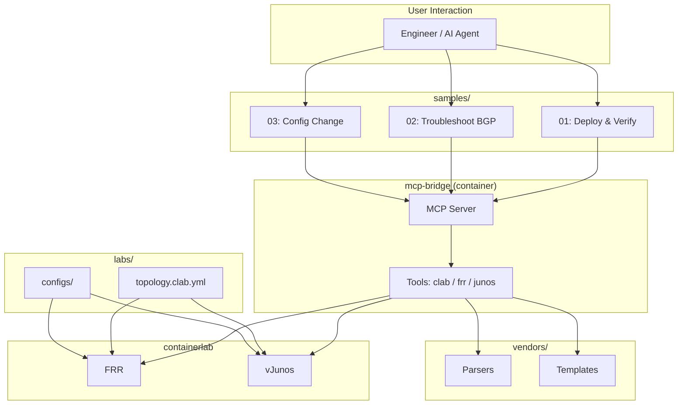

# Repository Structure

Project directory layout and component responsibilities.

## Directory Tree

```
clab-ai-orchestrator/
│
├── agent.md                 # AI agent definition (behavior, tech context)
├── README.md                # Project overview & quick start
├── docker-compose.yml       # mcp-bridge container management
├── .env.example             # Environment variable template
├── .gitignore               # Git exclusions
│
├── setup/                   # 🔧 Environment Setup
│   └── install.sh           #   Ubuntu 24.04 automated setup script
│                            #   Installs Docker, containerlab, vrnetlab, FRR
│
├── images/                  # 📦 VM Images (git-ignored)
│   └── .gitkeep             #   Only directory structure is tracked
│                            #   Place vJunos-router-*.qcow2 here
│
├── labs/                    # 🌐 Containerlab Topology Definitions
│   ├── README.md            #   Lab index
│   └── basic-bgp/           #   Basic eBGP lab (FRR + vJunos)
│       ├── topology.clab.yml
│       └── configs/         #   Per-node initial configs
│           ├── frr1/
│           └── vjunos1/
│
├── samples/                 # 📝 Usage Examples & Scenarios
│   ├── README.md            #   Scenario index
│   ├── 01_deploy_and_verify/ #  Lab deploy → BGP verification flow
│   ├── 02_troubleshoot_bgp/ #   BGP fault investigation & repair
│   └── 03_config_change/    #   Config change & rollback
│
├── mcp-bridge/              # 🐍 MCP Server (Python)
│   ├── Dockerfile           #   Container image definition
│   ├── pyproject.toml       #   Package definition
│   ├── requirements.lock    #   Fully pinned dependencies
│   ├── README.md
│   └── src/mcp_bridge/
│       ├── server.py        #   MCP server entry point (STDIO)
│       ├── tools/           #   MCP tool implementations
│       │   ├── clab.py      #     containerlab operations
│       │   ├── frr.py       #     FRR vtysh operations
│       │   └── junos.py     #     vJunos CLI operations
│       └── utils/
│           └── docker.py    #     Docker exec helper
│
├── vendors/                 # 📊 Vendor Modules
│   ├── README.md
│   ├── frr/
│   │   ├── parser.py        #   FRR output parser (BGP summary, IP route)
│   │   └── templates/       #   Jinja2 config templates
│   └── junos/
│       ├── parser.py        #   Junos output parser (text/JSON)
│       └── templates/       #   Jinja2 config templates
│
└── docs/                    # 📚 Documentation
    ├── repository-structure.md  # ← This file
    ├── setup-guide.md           # Detailed setup instructions
    ├── architecture.md          # Architecture design & diagrams
    ├── roadmap.md               # Project roadmap
    ├── version-strategy.md      # Version pinning policy
    └── troubleshooting.md       # Common issues & fixes
```

## Component Relationships



## Adding a New Vendor

1. Create `vendors/<vendor>/parser.py`
2. Add templates in `vendors/<vendor>/templates/`
3. Implement tools in `mcp-bridge/src/mcp_bridge/tools/<vendor>.py`
4. Register tools in `server.py`
5. Add a corresponding topology in `labs/`
6. Add usage examples in `samples/`
