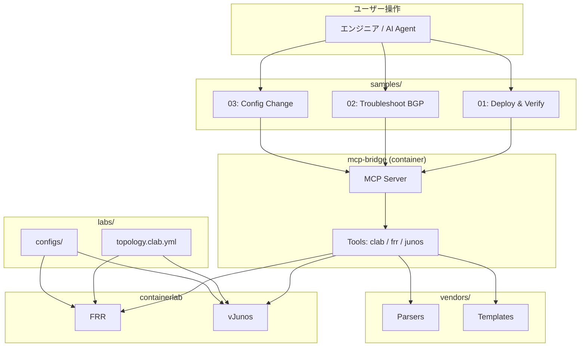

# リポジトリ構造

本プロジェクトのディレクトリ構成と、各コンポーネントの役割を解説します。

## ディレクトリツリー

```
clab-ai-orchestrator/
│
├── agent.md                 # AI エージェント定義（行動規範・技術コンテキスト）
├── README.md                # プロジェクト概要・クイックスタート
├── docker-compose.yml       # mcp-bridge コンテナ管理
├── .env.example             # 環境変数テンプレート
├── .gitignore               # Git 除外設定
│
├── setup/                   # 🔧 環境構築
│   └── install.sh           #   Ubuntu 24.04 自動セットアップスクリプト
│                            #   Docker, containerlab, vrnetlab, FRR を一括インストール
│
├── images/                  # 📦 VM イメージ格納 (git管理外)
│   └── .gitkeep             #   ディレクトリ構造のみ管理
│                            #   ここに vJunos-router-*.qcow2 を配置する
│
├── labs/                    # 🌐 containerlab トポロジ定義
│   ├── README.md            #   ラボ一覧と使い方
│   └── basic-bgp/           #   基本 eBGP ラボ (FRR + vJunos)
│       ├── topology.clab.yml
│       └── configs/         #   ノード別初期コンフィグ
│           ├── frr1/
│           └── vjunos1/
│
├── samples/                 # 📝 使用例・シナリオ
│   ├── README.md            #   サンプル一覧
│   ├── 01_deploy_and_verify/ #  ラボデプロイ→BGP確認の基本フロー
│   ├── 02_troubleshoot_bgp/ #   BGP障害の調査・修復シナリオ
│   └── 03_config_change/    #   設定変更・ロールバックのシナリオ
│
├── mcp-bridge/              # 🐍 MCP サーバ (Python)
│   ├── Dockerfile           #   コンテナイメージ定義
│   ├── pyproject.toml       #   パッケージ定義
│   ├── requirements.lock    #   依存バージョン完全固定
│   ├── README.md
│   └── src/mcp_bridge/
│       ├── server.py        #   MCP サーバ本体 (STDIO)
│       ├── tools/           #   MCP ツール実装
│       │   ├── clab.py      #     containerlab 操作
│       │   ├── frr.py       #     FRR vtysh 操作
│       │   └── junos.py     #     vJunos CLI 操作
│       └── utils/
│           └── docker.py    #     Docker コンテナ実行ヘルパー
│
├── vendors/                 # 📊 ベンダー別モジュール
│   ├── README.md
│   ├── frr/
│   │   ├── parser.py        #   FRR 出力パーサ (BGP summary, IP route)
│   │   └── templates/       #   Jinja2 設定テンプレート
│   └── junos/
│       ├── parser.py        #   Junos 出力パーサ (text/JSON)
│       └── templates/       #   Jinja2 設定テンプレート
│
└── docs/                    # 📚 ドキュメント
    ├── repository-structure.md  # ← このファイル
    ├── setup-guide.md           # 詳細セットアップ手順
    ├── architecture.md          # アーキテクチャ設計・フロー図
    ├── troubleshooting.md       # よくある問題と対処法
    └── version-strategy.md      # バージョン管理戦略
```

## コンポーネント関係図



## 新しいベンダーを追加するとき

1. `vendors/<vendor>/parser.py` を作成
2. `vendors/<vendor>/templates/` にテンプレート追加
3. `mcp-bridge/src/mcp_bridge/tools/<vendor>.py` にツール実装
4. `server.py` にツール登録
5. `labs/` に対応トポロジを追加
6. `samples/` に使用例を追加
