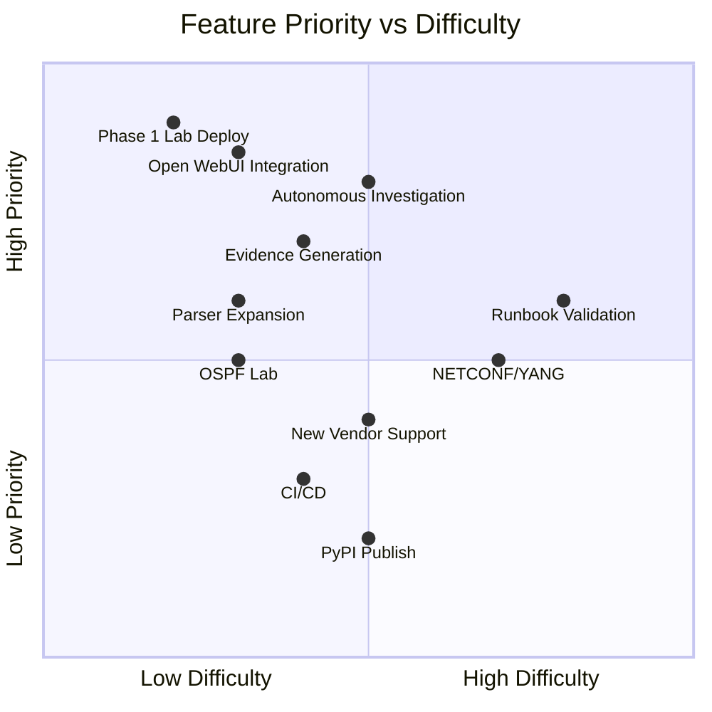

# 🗺 Roadmap

Project roadmap. Incrementally achieving the 5 Core Objectives defined in `agent.md`.

---

## Status

---

## Phase 0: Foundation ✅ Done

> Build the repository skeleton and define the minimal lab.

| Deliverable | Status |
|-------------|--------|
| Repository structure (labs/, mcp-bridge/, vendors/, docs/, samples/) | ✅ |
| basic-bgp topology (FRR + vJunos P2P BGP) | ✅ |
| mcp-bridge skeleton (Python, STDIO, 7 tools) | ✅ |
| Dockerfile + requirements.lock (version pinning) | ✅ |
| Documentation (setup-guide, architecture, troubleshooting, version-strategy) | ✅ |
| 3 sample scenarios | ✅ |

---

## Phase 1: Working Lab 🔧 In Progress

> Deploy and operate a real lab on the server via MCP.

### 1.1 Environment Setup
- [x] Clone repo to lab server
- [x] Run `sudo bash setup/install.sh`
- [x] Build vJunos Docker image via vrnetlab (Deferred to Expansion Phase)
- [x] Deploy basic-bgp lab with `sudo clab deploy`
- [x] Verify BGP Established

### 1.2 mcp-bridge Validation
- [x] Install and start mcp-bridge
- [x] Test each tool (clab_inspect, frr_show, frr_config)
- [x] Test Docker container execution (`docker compose up`)

### 1.3 Open WebUI Integration
- [x] Deploy Open WebUI on lab server
- [x] Register mcp-bridge as MCP server
- [x] Verify natural language → MCP tool invocation works

### 🏁 Phase 1 Completion Criteria
- [x] "Deploy lab and check BGP status" works end-to-end via Open WebUI

---

## Phase 2: AI-Driven Troubleshooting

> Enable autonomous fault investigation and repair by AI agents.

### 2.1 Autonomous Investigation Workflow
- [ ] Implement Plan → Act → Reflect → Document pattern
- [ ] Investigation logic: L1 → L2 → L3 → BGP staged checks
- [ ] Embed `agent.md` workflow into mcp-bridge prompts
- [ ] Verify samples/02 scenario runs autonomously

### 2.2 Parser Expansion
- [ ] FRR: `show ip bgp neighbor`, `show ip ospf neighbor`, `show interface` parsers
- [ ] Junos: `show bgp neighbor`, `show ospf neighbor`, `show interfaces` parsers
- [ ] Anomaly detection logic (alert when state ≠ Established, etc.)

### 2.3 Automated Evidence Generation
- [ ] Auto-generate verification reports as Markdown
- [ ] Auto-generate Mermaid topology diagrams from topology.clab.yml
- [ ] Before/After diff reports

### 🏁 Phase 2 Completion Criteria
- [ ] AI autonomously identifies root cause → repairs → generates report

---

## Phase 3: Expansion

> Expand vendor support, protocols, and topology scale.

### 3.1 Protocol Expansion
- [ ] OSPF lab (FRR + vJunos)
- [ ] BGP + OSPF combined lab (IGP/EGP interplay)
- [ ] BFD integration
- [ ] IS-IS lab

### 3.2 Topology Scale
- [ ] 4-node topology (FRR×2 + vJunos×2, full-mesh / hub-spoke)
- [ ] Topology templates: generate any topology from parameters
- [ ] Labs generator tool

### 3.3 New Vendor Support
- [ ] Arista cEOS (eAPI parser + templates)
- [ ] Nokia SR Linux
- [ ] AMD CPU support for vJunos (rebuild via vrnetlab with nested virt options)
- [ ] Plugin architecture for `vendors/`

### 3.4 Advanced Features
- [ ] NETCONF/YANG support (ncclient / PyEZ)
- [ ] Runbook validation: auto-compare Markdown runbooks ↔ live state
- [ ] Configuration drift detection

### 3.5 MCP Transport Expansion
- [ ] Add HTTP+SSE transport (remote operation from Mac)
- [ ] Authentication & authorization

### 🏁 Phase 3 Completion Criteria
- [ ] 3+ vendors, 2+ protocols working
- [ ] AI can identify contradictions in runbooks

---

## Phase 4: OSS Release

> Publish as a public GitHub repository and engage the community.

### 4.1 Quality
- [ ] pytest-based automated tests (parsers, templates)
- [ ] GitHub Actions CI/CD (lint, test, Docker build)
- [ ] pre-commit hooks (ruff, mypy)

### 4.2 Community
- [ ] CONTRIBUTING.md
- [ ] Code of Conduct
- [ ] Issue / PR templates
- [ ] Demo video / GIF (Open WebUI + mcp-bridge live demo)

### 4.3 Packaging
- [ ] PyPI publish (`pip install mcp-bridge`)
- [ ] Docker Hub / ghcr.io image publish
- [ ] GitHub Releases + Changelog

### 🏁 Phase 4 Completion Criteria
- [ ] Anyone can set up → deploy lab → AI-operate using only the README
- [ ] GitHub Stars ≥ 10 🌟

---

## Priority Matrix

