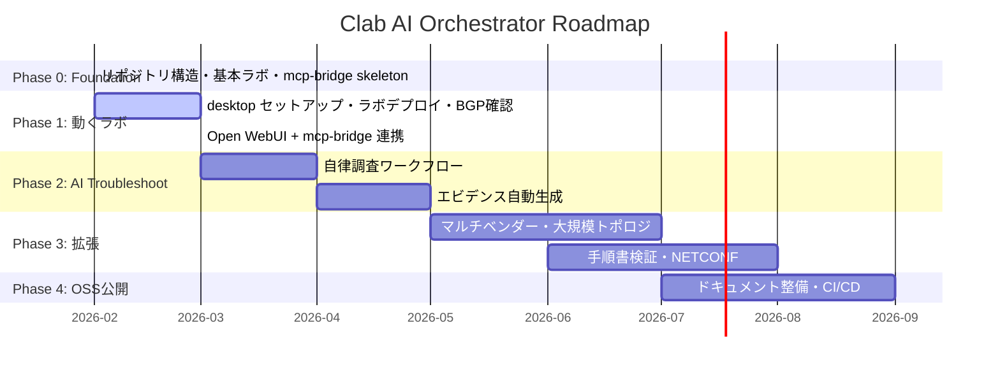
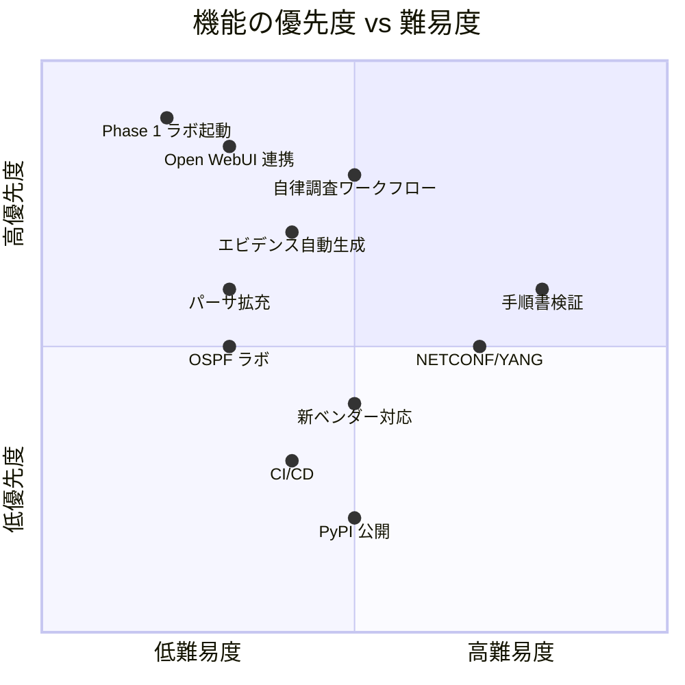

# 🗺 Roadmap - Clab AI Orchestrator

プロジェクトの中長期ロードマップ。`agent.md` の5つの Core Objectives を段階的に達成する。

---

## 現在地

---

## Phase 0: Foundation ✅ 完了

> リポジトリの骨格を作り、最小構成のラボを定義する。

| 成果物 | 状態 |
|--------|------|
| リポジトリ構造 (labs/, mcp-bridge/, vendors/, docs/, samples/) | ✅ |
| basic-bgp トポロジ (FRR + vJunos P2P BGP) | ✅ |
| mcp-bridge skeleton (Python, STDIO, 7ツール) | ✅ |
| Dockerfile + requirements.lock (バージョン固定) | ✅ |
| docs (setup-guide, architecture, troubleshooting, version-strategy) | ✅ |
| samples 3シナリオ | ✅ |

---

## Phase 1: 動くラボ 🔧 進行中

> ラボサーバで実際にラボを動かし、MCP 経由で操作できる状態にする。

### 1.1 環境セットアップ
- [ ] ラボサーバに git clone
- [ ] `sudo bash setup/install.sh` 実行
- [ ] vrnetlab で vJunos Docker イメージをビルド
- [ ] `sudo clab deploy` で basic-bgp ラボ起動
- [ ] BGP Established 確認

### 1.2 mcp-bridge 実動
- [ ] mcp-bridge の pip install & 起動テスト
- [ ] 各ツール (clab_inspect, frr_show, junos_show) の動作検証
- [ ] Docker コンテナ実行 (`docker compose up`) の検証

### 1.3 Open WebUI 連携
- [ ] Open WebUI を desktop にデプロイ
- [ ] MCP サーバとして mcp-bridge を登録
- [ ] Open WebUI から自然言語で「BGP の状態を見せて」→結果が返ることを確認

### 🏁 Phase 1 完了基準
- [ ] Open WebUI 上で「ラボをデプロイして BGP 状態を確認」が一気通貫で動く

---

## Phase 2: AI 駆動型トラブルシューティング

> AI エージェントが自律的に障害を調査・修復できるようにする。

### 2.1 自律調査ワークフロー
- [ ] Plan → Act → Reflect → Document パターンの実装
- [ ] 調査ロジック: L1→L2→L3→BGP の段階的チェック
- [ ] `agent.md` のワークフロー定義を mcp-bridge の prompt に組込み
- [ ] samples/02 のシナリオを自動実行できることを確認

### 2.2 パーサの拡充
- [ ] FRR: `show ip bgp neighbor`, `show ip ospf neighbor`, `show interface` パーサ追加
- [ ] Junos: `show bgp neighbor`, `show ospf neighbor`, `show interfaces` パーサ追加
- [ ] 異常検出ロジック（State が Established でない場合のアラート等）

### 2.3 エビデンス自動生成
- [ ] 検証結果を Markdown レポートとして自動出力
- [ ] トポロジ図の Mermaid 自動生成 (topology.clab.yml → Mermaid)
- [ ] Before/After 差分レポート

### 🏁 Phase 2 完了基準
- [ ] AI に「BGP が落ちているので調査して」と言えば、自律的に原因特定→修復→レポート出力

---

## Phase 3: 拡張

> 対応ベンダー・プロトコル・トポロジ規模を拡張する。

### 3.1 プロトコル拡張
- [ ] OSPF ラボ (FRR + vJunos)
- [ ] BGP + OSPF 混在ラボ (IGP/EGP 連携)
- [ ] BFD 連携
- [ ] IS-IS ラボ

### 3.2 トポロジスケール
- [ ] 4ノード構成 (FRR×2 + vJunos×2, フルメッシュ/ハブスポーク)
- [ ] トポロジテンプレート: ユーザーがパラメータ指定で any 構成を生成
- [ ] labs/ ジェネレータツール

### 3.3 新ベンダー対応
- [ ] Arista cEOS 対応 (eAPI パーサ + テンプレート)
- [ ] Nokia SR Linux 対応
- [ ] vendors/ プラグインアーキテクチャの整備

### 3.4 高度な機能
- [ ] NETCONF/YANG 対応 (ncclient / PyEZ)
- [ ] 手順書検証: Markdown 手順書 ↔ 実機状態の自動比較
- [ ] 設定ドリフト検出

### 3.5 MCP 通信拡張
- [ ] HTTP+SSE トランスポート追加 (Mac からリモート操作)
- [ ] 認証・認可

### 🏁 Phase 3 完了基準
- [ ] 3ベンダー以上、2プロトコル以上のラボが動作
- [ ] 手順書を渡すと AIが矛盾を指摘できる

---

## Phase 4: OSS 公開

> GitHub パブリックリポジトリとして公開し、コミュニティに貢献する。

### 4.1 品質整備
- [ ] pytest による自動テスト (パーサ、テンプレート)
- [ ] GitHub Actions CI/CD (lint, test, Docker build)
- [ ] pre-commit hooks (ruff, mypy)

### 4.2 ドキュメント整備
- [ ] Contributing Guide (CONTRIBUTING.md)
- [ ] Code of Conduct
- [ ] Issue / PR テンプレート
- [ ] デモ動画 / GIF (Open WebUI + mcp-bridge のライブデモ)

### 4.3 パッケージング
- [ ] PyPI 公開 (`pip install mcp-bridge`)
- [ ] Docker Hub / ghcr.io にイメージ公開
- [ ] GitHub Releases + Changelog

### 🏁 Phase 4 完了基準
- [ ] 他のエンジニアが README だけで環境構築→ラボ起動→AI操作できる
- [ ] GitHub Stars ≥ 10 🌟

---

## 優先度マトリクス

