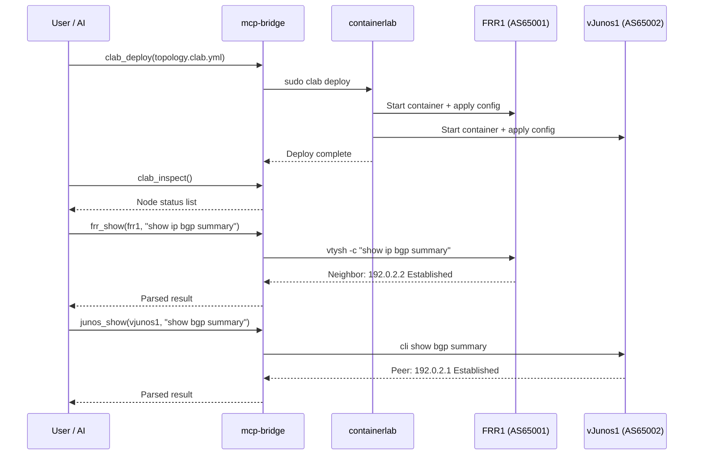

# Sample 01: Deploy & Verify

Deploy a lab and verify that BGP peering is established correctly.

## Overview



## Steps

### Step 1: Deploy the Lab

**MCP Tool:**
```json
{
  "tool": "clab_deploy",
  "arguments": {
    "topology_file": "labs/basic-bgp/topology.clab.yml"
  }
}
```

**Manual CLI:**
```bash
sudo clab deploy -t labs/basic-bgp/topology.clab.yml
```

### Step 2: Inspect Node Status

**MCP Tool:**
```json
{
  "tool": "clab_inspect",
  "arguments": {
    "topology_file": "labs/basic-bgp/topology.clab.yml"
  }
}
```

**Expected output:**
```
+---+--------------------------+-----------+---------+------+------+
| # |          Name            |   Kind    |  State  | IPv4 | IPv6 |
+---+--------------------------+-----------+---------+------+------+
| 1 | clab-basic-bgp-frr1      | linux     | running | ...  | ...  |
| 2 | clab-basic-bgp-vjunos1   | juniper_vjunosrouter | running | ...  | ...  |
+---+--------------------------+-----------+---------+------+------+
```

### Step 3: Check FRR BGP Status

**MCP Tool:**
```json
{
  "tool": "frr_show",
  "arguments": {
    "container_name": "clab-basic-bgp-frr1",
    "command": "show ip bgp summary"
  }
}
```

**Manual CLI:**
```bash
docker exec clab-basic-bgp-frr1 vtysh -c "show ip bgp summary"
```

**Expected output:**
```
IPv4 Unicast Summary:
BGP router identifier 10.0.0.1, local AS number 65001
...
Neighbor        V  AS   MsgRcvd  MsgSent  Up/Down   State/PfxRcd
192.0.2.2       4 65002     XX       XX    HH:MM:SS           1
```
> If `State/PfxRcd` shows a number (received prefix count), the session is **Established**.

### Step 4: Check vJunos BGP Status

**MCP Tool:**
```json
{
  "tool": "junos_show",
  "arguments": {
    "container_name": "clab-basic-bgp-vjunos1",
    "command": "show bgp summary"
  }
}
```

### Step 5: Verify Routes

```bash
# FRR: Check if vJunos loopback (10.0.0.2/32) is learned via BGP
docker exec clab-basic-bgp-frr1 vtysh -c "show ip route bgp"

# vJunos: Check if FRR loopback (10.0.0.1/32) is learned via BGP
docker exec clab-basic-bgp-vjunos1 cli show route protocol bgp
```

## Success Criteria

- [ ] Both nodes are in `running` state
- [ ] BGP neighbor is `Established`
- [ ] Both sides have learned the peer's loopback route (FRR: 10.0.0.2/32, vJunos: 10.0.0.1/32)
- [ ] Loopback-to-loopback ping succeeds

```bash
docker exec clab-basic-bgp-frr1 ping -c 3 10.0.0.2
```
