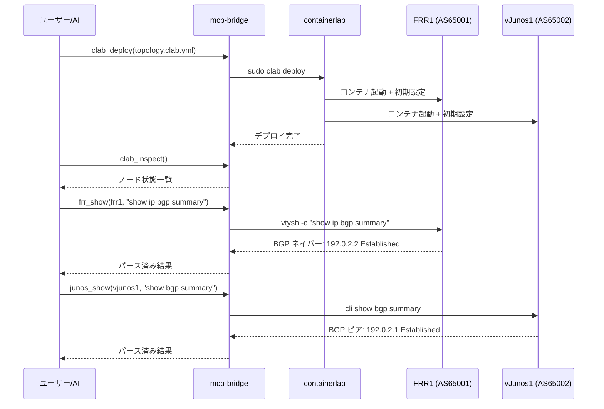

# Sample 01: Deploy & Verify

ラボをデプロイし、BGP ピアリングが正常に確立されることを確認する基本シナリオ。

## 概要



## 手順

### Step 1: ラボをデプロイ

**MCP ツール:**
```json
{
  "tool": "clab_deploy",
  "arguments": {
    "topology_file": "labs/basic-bgp/topology.clab.yml"
  }
}
```

**手動 CLI:**
```bash
sudo clab deploy -t labs/basic-bgp/topology.clab.yml
```

### Step 2: ノード状態を確認

**MCP ツール:**
```json
{
  "tool": "clab_inspect",
  "arguments": {
    "topology_file": "labs/basic-bgp/topology.clab.yml"
  }
}
```

**手動 CLI:**
```bash
sudo clab inspect -t labs/basic-bgp/topology.clab.yml
```

**期待される出力:**
```
+---+--------------------------+-----------+-------+------+---------+
| # |          Name            |   Kind    | State | IPv4 | IPv6    |
+---+--------------------------+-----------+-------+------+---------+
| 1 | clab-basic-bgp-frr1      | linux     | running | ... | ...  |
| 2 | clab-basic-bgp-vjunos1   | juniper_vjunos | running | ... | ...  |
+---+--------------------------+-----------+-------+------+---------+
```

### Step 3: FRR の BGP 状態を確認

**MCP ツール:**
```json
{
  "tool": "frr_show",
  "arguments": {
    "container_name": "clab-basic-bgp-frr1",
    "command": "show ip bgp summary"
  }
}
```

**手動 CLI:**
```bash
docker exec clab-basic-bgp-frr1 vtysh -c "show ip bgp summary"
```

**期待される出力:**
```
IPv4 Unicast Summary:
BGP router identifier 10.0.0.1, local AS number 65001
...
Neighbor        V  AS   MsgRcvd  MsgSent  Up/Down   State/PfxRcd
192.0.2.2       4 65002     XX       XX    HH:MM:SS           1
```
> `State/PfxRcd` が数字（受信プレフィクス数）なら **Established** です。

### Step 4: vJunos の BGP 状態を確認

**MCP ツール:**
```json
{
  "tool": "junos_show",
  "arguments": {
    "container_name": "clab-basic-bgp-vjunos1",
    "command": "show bgp summary"
  }
}
```

**手動 CLI:**
```bash
docker exec clab-basic-bgp-vjunos1 cli show bgp summary
```

### Step 5: 経路を確認

```bash
# FRR: vJunos の Loopback (10.0.0.2/32) が BGP で学習されているか
docker exec clab-basic-bgp-frr1 vtysh -c "show ip route bgp"

# vJunos: FRR の Loopback (10.0.0.1/32) が BGP で学習されているか
docker exec clab-basic-bgp-vjunos1 cli show route protocol bgp
```

## 成功基準

- [ ] 両ノードが `running` 状態
- [ ] BGP ネイバーが `Established`
- [ ] 双方向でLoopback経路を学習 (FRR: 10.0.0.2/32, vJunos: 10.0.0.1/32)
- [ ] Loopback 間の ping が成功

```bash
docker exec clab-basic-bgp-frr1 ping -c 3 10.0.0.2
```
