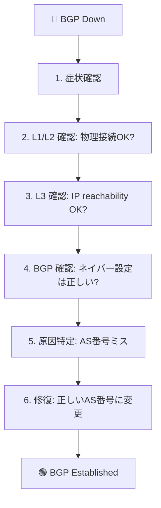

# Sample 02: Troubleshoot BGP

BGP ピアリングが確立しない障害を調査し、修復するシナリオ。

## シナリオ概要

FRR1 の BGP ネイバー設定を意図的に間違え、障害を発生させた後、
AIエージェント（または手動）で原因を特定し修復します。



## 手順

### Step 1: 障害を発生させる

FRR1 のネイバー設定で **間違った**リモートAS番号を設定する。

**MCP ツール:**
```json
{
  "tool": "frr_config",
  "arguments": {
    "container_name": "clab-basic-bgp-frr1",
    "config_commands": [
      "router bgp 65001",
      "no neighbor 192.0.2.2 remote-as 65002",
      "neighbor 192.0.2.2 remote-as 65099"
    ]
  }
}
```

**手動 CLI:**
```bash
docker exec clab-basic-bgp-frr1 vtysh -c "conf t" \
  -c "router bgp 65001" \
  -c "no neighbor 192.0.2.2 remote-as 65002" \
  -c "neighbor 192.0.2.2 remote-as 65099" \
  -c "end"
```

### Step 2: 症状を確認

```json
{
  "tool": "frr_show",
  "arguments": {
    "container_name": "clab-basic-bgp-frr1",
    "command": "show ip bgp summary"
  }
}
```

**期待される出力:** State が `OpenSent` / `Active` (Established でない)

### Step 3: 調査ワークフロー

AIエージェントが自律的に行う場合の調査フロー:

```
1. frr_show → "show ip bgp summary"
   → ネイバーが Established でない

2. frr_show → "show ip bgp neighbor 192.0.2.2"
   → "remote AS 65099" が表示される
   → "Last error: ...Bad peer AS" が表示される

3. junos_show → "show bgp summary"
   → vJunos 側も Established でない

4. 比較推論:
   → FRR 側: remote-as 65099
   → vJunos 側: local-as 65002
   → ミスマッチが原因と判断
```

### Step 4: 修復

**MCP ツール:**
```json
{
  "tool": "frr_config",
  "arguments": {
    "container_name": "clab-basic-bgp-frr1",
    "config_commands": [
      "router bgp 65001",
      "no neighbor 192.0.2.2 remote-as 65099",
      "neighbor 192.0.2.2 remote-as 65002"
    ]
  }
}
```

### Step 5: 復旧確認

```json
{
  "tool": "frr_show",
  "arguments": {
    "container_name": "clab-basic-bgp-frr1",
    "command": "show ip bgp summary"
  }
}
```

**期待される出力:** State が `Established` に復旧

## 学べること

- BGP の障害調査フロー（L1→L2→L3→L4）
- `show ip bgp neighbor` の "Last error" から原因を特定する方法
- MCP ツール経由での設定変更・自動修復
