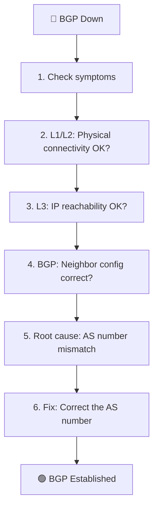

# Sample 02: Troubleshoot BGP

Investigate and repair a BGP peering failure.

## Scenario

Intentionally misconfigure FRR1's BGP neighbor, then use AI agents (or manual steps) to identify the root cause and repair it.



## Steps

### Step 1: Inject the Fault

Set an **incorrect** remote AS number on FRR1.

**MCP Tool:**
```json
{
  "tool": "frr_config",
  "arguments": {
    "container_name": "clab-basic-bgp-frr1",
    "config_commands": [
      "router bgp 65001",
      "no neighbor 192.0.2.2 remote-as 65002",
      "neighbor 192.0.2.2 remote-as 65099"
    ]
  }
}
```

### Step 2: Observe the Symptom

```json
{
  "tool": "frr_show",
  "arguments": {
    "container_name": "clab-basic-bgp-frr1",
    "command": "show ip bgp summary"
  }
}
```

**Expected:** State shows `OpenSent` / `Active` (not Established)

### Step 3: Investigation Workflow

When an AI agent investigates autonomously:

```
1. frr_show → "show ip bgp summary"
   → Neighbor is NOT Established

2. frr_show → "show ip bgp neighbor 192.0.2.2"
   → Shows "remote AS 65099"
   → Shows "Last error: ...Bad peer AS"

3. junos_show → "show bgp summary"
   → vJunos side also NOT Established

4. Reasoning:
   → FRR side: remote-as 65099
   → vJunos side: local-as 65002
   → Mismatch identified as root cause
```

### Step 4: Repair

**MCP Tool:**
```json
{
  "tool": "frr_config",
  "arguments": {
    "container_name": "clab-basic-bgp-frr1",
    "config_commands": [
      "router bgp 65001",
      "no neighbor 192.0.2.2 remote-as 65099",
      "neighbor 192.0.2.2 remote-as 65002"
    ]
  }
}
```

### Step 5: Verify Recovery

```json
{
  "tool": "frr_show",
  "arguments": {
    "container_name": "clab-basic-bgp-frr1",
    "command": "show ip bgp summary"
  }
}
```

**Expected:** State returns to `Established`

## What You Learn

- BGP investigation flow (L1 → L2 → L3 → L4)
- Using `show ip bgp neighbor` "Last error" to identify root cause
- Automated config repair via MCP tools
